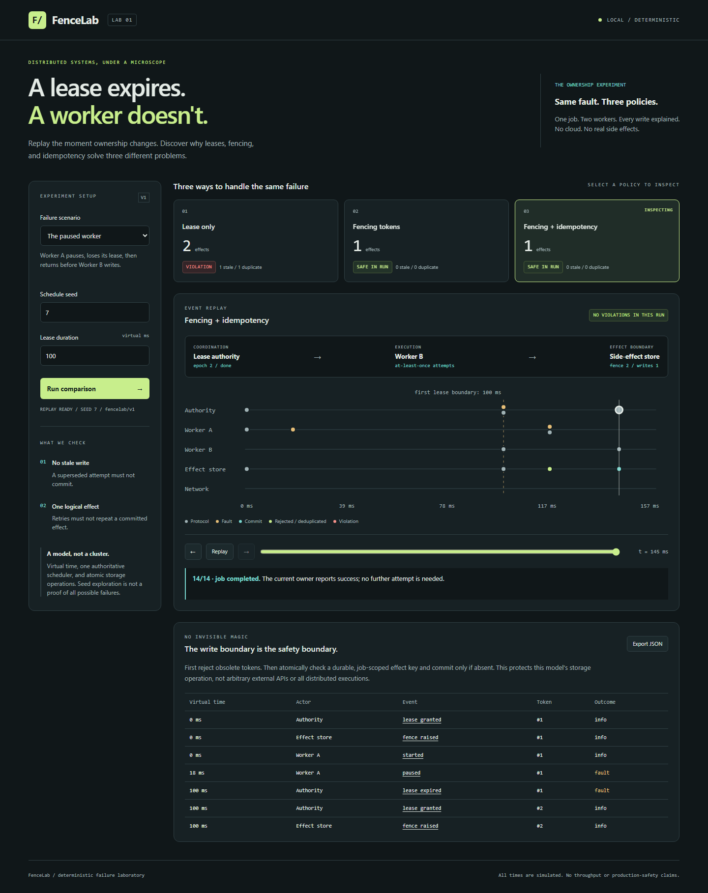

# FenceLab

**A lease expires. A worker doesn't.**

FenceLab is a deterministic failure laboratory for distributed job execution.
Pause a worker, let its lease expire, assign a replacement, and watch the old
worker return. Then lose an acknowledgment after a successful write.
What actually prevents the wrong side effect?

The answer is not one mechanism: **leases decide ownership, fencing rejects old
owners, and idempotency prevents repeated logical effects.** FenceLab runs the
same seeded failure schedule under three policies so you can inspect the
difference at the write boundary.

[Run locally](#run-locally) · [The experiment](#the-experiment) ·
[Architecture](docs/architecture.md) · [Next milestones](docs/roadmap.md) ·
[Recorded evidence](docs/evidence.md)



## The experiment

One job, two workers, one lease authority, and an atomic side-effect store.
The first milestone is a **single-process simulation**, not a distributed
cluster or a production scheduler. All displayed milliseconds are virtual.

| Scenario | Lease only | Fencing | Fencing + idempotency |
|---|---|---|---|
| Paused worker returns after reassignment | Stale write and duplicate effect | Old token rejected | Old token rejected |
| Write succeeds, acknowledgment is lost | Old retry and new owner repeat effect | Old retry rejected; new owner still repeats effect | Old retry rejected; new owner gets original result |
| Healthy baseline | One effect | One effect | One effect |

For seed `7` with a `100 ms` virtual lease, accepted effect counts are:

```text
                        lease-only    fenced    fenced-idempotent
paused-worker               2            1              1
lost-ack                    3            2              1
healthy                     1            1              1
```

These are reproduced model outcomes, not throughput measurements.

### The important trade-off

A token attached to a request is not sufficient by itself. In this model,
**storage acknowledges a newer fence before a replacement worker is
dispatched**. That is why an old worker is rejected even if it returns before
the replacement writes. Real implementations must supply that ordered storage
barrier; simply recording the highest token seen on normal writes is weaker.

Fencing also does not deduplicate a valid newer attempt. That requires a
job-scoped effect key checked atomically with the effect. The model assumes
durable fencing and effect-key state, but does not yet implement disk persistence
or storage crashes. It makes no general "exactly-once execution" claim.

## Run locally

Install **Go 1.27+**, then:

```sh
git clone https://github.com/PoojaAgarwal2003/FenceLab.git
cd FenceLab
go run ./cmd/fencelab serve
```

Open **http://127.0.0.1:8091**. Choose a scenario, run the comparison, and select
a policy card. Step through the trace, scrub virtual time, or export the
comparison as JSON. Ctrl+C stops the server.

No database, Docker, Node.js, API key, or paid service is required to run it.
The Go binary embeds the HTML, CSS, and JavaScript:

```sh
go build -o bin/fencelab ./cmd/fencelab
```

On Windows, use `-o bin/fencelab.exe`. The binary works without a source checkout
or a frontend build. You can select another loopback port with
`serve -listen 127.0.0.1:8092`.

The server is unauthenticated and deliberately binds only to a **numeric
loopback address**. Do not expose it through a public proxy or tunnel.

## Replay from the CLI

```sh
# An intentionally unsafe execution, including its exact violation witnesses.
go run ./cmd/fencelab run -scenario paused-worker -policy lease-only -seed 7

# Same fault schedule, three alternative policies.
go run ./cmd/fencelab compare -scenario lost-ack -seed 7 -lease-ms 100

# 1,000 seeds x 3 scenarios x 3 policies = 9,000 model runs.
go run ./cmd/fencelab check -start-seed 0 -seeds 1000
```

Output is JSON, with no status text mixed into stdout. `run` and `compare` return
exit code `0` when the experiment executes, even if a deliberately unsafe policy
violates an invariant. Inspect `summary.safe` and `violations`.
`check` returns `1` for unexpected outcomes, `2` for invalid input, and `0` when
both the unsafe baselines and protected policy behave as expected.

The first recorded sweep produced **3,000 expected unsafe runs, zero protected
failures, and zero unexpected outcomes**. It explores seeded timings within
three fixed templates, **not every possible interleaving**. See
[raw evidence and scope](docs/evidence.md).

| Option | Meaning |
|---|---|
| `-scenario` | `paused-worker`, `lost-ack`, or `healthy` |
| `-policy` | `lease-only`, `fenced`, or `fenced-idempotent`; `run` only |
| `-seed` | Signed 64-bit schedule seed; default `7` |
| `-lease-ms` | Virtual lease length, `20` to `10000`; default `100` |
| `-start-seed` | First seed for `check`; default `0` |
| `-seeds` | Number of seeds for `check`, `1` to `10000`; default `100` |

The browser/API restrict seeds to JavaScript's exact integer range. Replay
requires the same config **and model version** (`fencelab/v1`).

## Engineering underneath

- **Discrete-event min-heap:** events are ordered by `(virtual time, insertion
  sequence)`. Same-time ordering is explicit and replayable.
- **Monotonic ownership epochs:** an old attempt remains identifiable after
  reassignment. The scheduler cannot recall a request already sent to storage.
- **Storage-side fencing barrier:** reject obsolete attempts at the component
  that actually commits effects, rather than only at the scheduler.
- **Atomic effect-key check:** keep a completed logical operation from being
  repeated by a valid replacement attempt.
- **Trace witnesses:** every violation points to the exact committing event,
  with token, current epoch, owner, and write count.
- **Matched experiments:** policies use the same generated schedule; changing
  protection does not silently change fault timings.

The model avoids goroutine scheduling, sleeps, wall-clock reads, and global
random state. The real HTTP interface has bounded admission, explicit overload
responses, request timeouts, and graceful shutdown.

## Development

```sh
go test -count=1 ./...
go vet ./...
go build ./...
go test ./internal/sim -run '^$' -bench BenchmarkCompare -benchmem
```

For browser development only, install Node.js 22+:

```sh
npm ci
npx playwright install chromium
npm run test:e2e
```

On Linux, `npx playwright install --with-deps chromium` also installs the
browser's OS dependencies. The suite starts and stops its own real Go server on
port `18091`, exercises desktop/mobile Chromium, and saves demonstration
screenshots under ignored `web-test-results/`.

CI runs Go checks on Windows/Linux, race detection on Linux, and Chromium tests.
The [contributor guide](CONTRIBUTING.md) defines the model's invariants and
evidence expectations.

## Where this goes next

The working **first milestone** is the deterministic ownership experiment.
The [roadmap](docs/roadmap.md) builds toward programmable partitions and message
faults, bounded state-space exploration, crash-safe persistence, and a
multi-process implementation checked against the model.

## Attribution and licensing

See [third-party notices](THIRD_PARTY_NOTICES.md) for Go and browser-test
dependencies, and [architecture references](docs/architecture.md#references)
for the underlying ideas. No project license has been granted yet; upstream
dependency licenses do not automatically license FenceLab.
